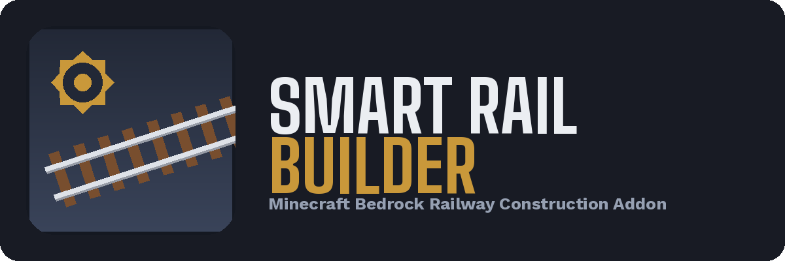

# Smart Rail Builder

**Version 1.0.0** · A Minecraft Bedrock Edition add-on that builds railways for you.

Hold a rail item, use it on a block, and configure the railway you want. Smart Rail Builder
plans the whole route, checks it is safe and that you can afford it, then lays the track —
following the terrain, bridging over gaps, or tunnelling underground.

---

## What it does

- Builds a **straight railway in the direction you are facing**, up to **64 blocks** per build.
- Reads the terrain and adapts: single-block rises and drops get proper sloped rails, and hills
  too tall to climb are bored through with a tunnel.
- Validates the entire route **before placing a single block**. If the route is unsafe or you
  are short on materials, nothing in the world is modified.
- Never overwrites an existing rail, chest, door, bed, sign, furnace or other protected block —
  it rejects the build instead.
- In Survival, deducts exactly what it places, one item at a time, only after each block is
  confirmed placed.

## Building modes

| Mode | What it does | Configurable range |
| --- | --- | --- |
| **Normal** | Follows the ground. Handles flat terrain, ±1-block slopes, and tunnels through taller rises. | — |
| **Bridge** | Rises gradually to your chosen height, runs level across the gap, then descends back to the ground. Uses lightweight piers (spaced every 4 blocks), not a solid wall of blocks. | Height **1–16** |
| **Underground** | Descends a ramp to your chosen depth, then runs level. Excavates a player-height corridor with an entrance, an exit, and a landing space at the end. | Depth **1–20** |

## Supported rail types

All four vanilla rails. Whichever one you are holding is the one that gets built:

- Rail
- Powered Rail
- Detector Rail
- Activator Rail

## How to use it

1. Install the `.mcaddon` and enable **both** the behavior pack and the resource pack on your world.
   (Both are required — the resource pack carries all of the add-on's text.)
2. Hold the rail type you want to build with.
3. Face the direction you want the railway to run.
4. Use the rail item on a block. The build menu opens.
5. Choose a **building mode** → (Bridge only: choose a **material** from your inventory) →
   set the **height/depth** and **length** → review the **summary** → press **Build**.
6. The railway is built over the next few seconds. Progress is shown on the action bar.

You can press Cancel on any screen; nothing is built until you confirm the summary screen.

## Survival behavior

- You must have enough rails for the full length, and (in Bridge mode) enough of your chosen
  bridge material. Both are checked before construction, and re-checked immediately before it
  starts.
- Items are deducted **one at a time, after each block is placed** — never up front, and never
  for a block that was not actually placed.
- If a build is interrupted (you run out of materials, the terrain changes, you cancel, die,
  disconnect, or change dimension), it stops safely. **Whatever was already built stays built,
  and you are not charged for anything beyond it.** There is no automatic rollback or refund.
- Excavated blocks (tunnel and underground digging) are removed, not dropped as items. Tunnelling
  costs no tools and no durability.

## Creative behavior

Creative Mode skips inventory quantity checks entirely — you are never blocked for "not enough
rails". You still need to be **holding** the rail type you want, so the add-on knows which to build.

## Multiplayer behavior

- Every player has their own independent menu, configuration, build plan, material choice,
  progress, and cancellation. One player's build never affects another's.
- If two players try to build through the same blocks at the same time, the second build is
  **rejected with a clear message** rather than being merged or allowed to corrupt the first.
- A player leaving, dying, or changing dimension cancels only their own build.

## Known limitations

This section is deliberately complete rather than flattering.

- **No in-game testing has been performed by the developer.** Every version of this add-on,
  including 1.0.0, has been verified only by static analysis and an automated Node.js test suite
  running against a mocked Minecraft API (432 assertions). It has never been run in a real
  Minecraft client. Please treat your first play session as the real test.
- **Ascending rail orientation is unverified against the live game.** The numeric block states
  used for sloped rails follow long-standing Minecraft convention and are internally consistent
  across all four directions, but were never confirmed against an official Bedrock source. If a
  slope tilts the wrong way, this is the most likely cause.
- **Rail crossings cannot be fully connected.** A vanilla rail block can only hold one shape at
  a time — there is no 4-way crossing rail in Minecraft. Where a new railway crosses an existing
  one, the existing rail is **left completely untouched** rather than being overwritten. That
  protects your existing track, but it means the crossing point may not connect on both lines.
- **Placing a rail next to a hand-placed rail may cause the game itself to re-shape that
  neighbour.** This is vanilla neighbour-update behavior, outside the add-on's control, and
  could not be verified without a live client.
- **Player structures made from ordinary blocks cannot be detected.** Chests, doors, beds, signs,
  furnaces and similar are protected by block type; a wall or bridge you built out of plain stone
  is indistinguishable from natural terrain and may be built through.
- **Maximum build length is 64 blocks**, by design. Longer routes risk outrunning the world's
  simulation distance mid-build.
- **Curved railways, automatic pathfinding, undo, blueprints and stations are not supported.**
  The add-on builds straight lines only.
- **Underground tunnels are unlit** and will spawn mobs. Bring torches.
- Only **English (en_US)** text is included.

## Technical

- Targets `@minecraft/server` **2.8.0** and `@minecraft/server-ui` **2.1.0** (stable APIs; no
  experimental toggles required).
- Minimum engine version **1.26.0**.
- Construction runs through `system.runJob`, spread across ticks, so long builds do not freeze
  the game.

## Documentation

- `docs/ARCHITECTURE.md` — full design record, including every bug found and fixed.
- `docs/CHANGELOG.md` — per-release history.
- `docs/ROADMAP.md` — development phases.
- `docs/TODO.md` — outstanding items and backlog.
